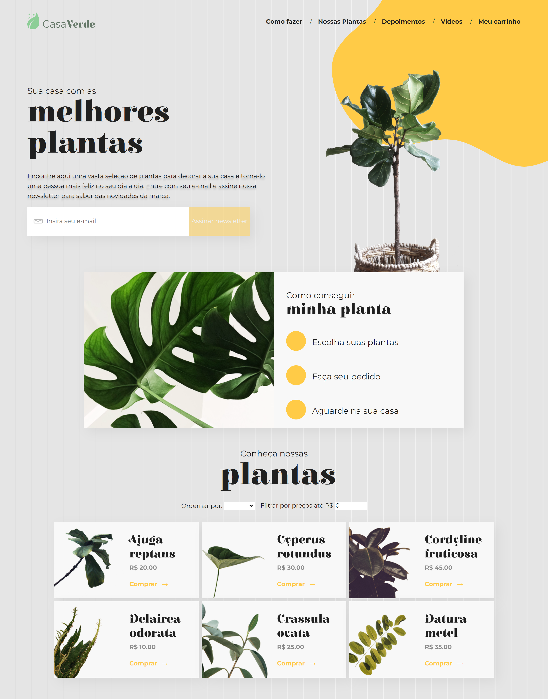

# Projeto Casa Verde

O projeto Casa Verde é um desafio do #7DaysOfCode da Alura, no qual devemos implementar um site de venda de plantas com base no [layout figma](https://www.figma.com/file/0yOQR6fGtbdrmqeStiO0jf/7Days-React?type=design&node-id=0-1) disponibilizado e desenvolver as funcionalidades solicitadas por e-mail ao longo de 7 dias. 

As seguintes tarefas foram solicitadas para a implementação:

1. Implementar os componentes de menu e assinatura da newsletter. 
2. Transformar o CSS em styled components (optei por utilizar Sass no projeto). 
3. Adicionar funcionalidades de cadastro e validação de e-mail ao formulário. O botão "Assinar Newsletter" só deve ser habilitado e permitir o cadastro quando um e-mail válido for preenchido. Após o cadastro, uma mensagem de alerta com um agradecimento deve ser exibida.
4.  Enviar um e-mail de confirmação de cadastro para os endereços cadastrados (optei por utilizar o [Emailjs](https://www.emailjs.com/)). 
5.  Conectar a aplicação a uma API de produtos. 
6.  Alterar a seção "Ofertas" para "Nossos Produtos" e adicionar as seguintes funcionalidades: 
    - Ordenação das plantas por nome e preço.
    - Filtro que remove da lista as plantas que estiverem fora do intervalo de preço definido. 
7. Fazer o deploy da aplicação na Vercel. 

## 💻 Layout  

  

 ## 🔧 Tecnologias 

As tecnologias usadas foram: 
* React
* Sass
* CSS modules
* Email js

## 🛠️ Abrir e rodar o projeto
Acesse o projeto publicado através deste link: https://casa-verde-gamma.vercel.app/
